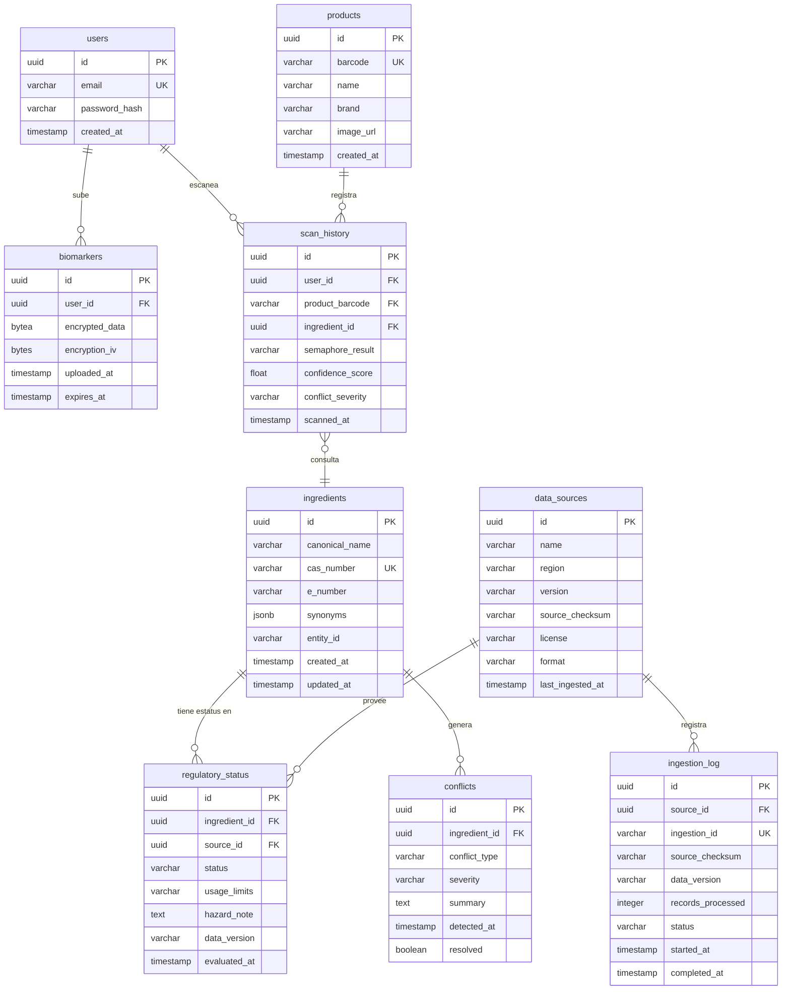

# 🏗️ BioShield AI — System Architecture

**Versión:** 1.0  
**Última actualización:** 2026-04-10

---

## 1. Database Schema

### 1.1 Motor de Base de Datos

| Entorno | Motor | Justificación |
|---|---|---|
| **Desarrollo local** | SQLite | Zero-config, ideal para iteración rápida |
| **Producción** | PostgreSQL (Render, plan gratuito) | Soporte nativo para JSON, cifrado, y concurrencia |

---

### 1.2 Diagrama Entidad-Relación



---

### 1.3 Definición de Tablas

#### `users`
Gestión de cuentas de usuario.

| Campo | Tipo | Restricción | Descripción |
|---|---|---|---|
| `id` | `UUID` | `PK, DEFAULT gen_random_uuid()` | Identificador único |
| `email` | `VARCHAR(255)` | `UNIQUE, NOT NULL` | Correo electrónico |
| `password_hash` | `VARCHAR(255)` | `NOT NULL` | Hash bcrypt de la contraseña |
| `created_at` | `TIMESTAMP` | `DEFAULT NOW()` | Fecha de registro |

---

#### `products`
Catálogo normalizado de productos escaneados. Evita duplicar datos de producto en cada fila de `scan_history`.

| Campo | Tipo | Restricción | Descripción |
|---|---|---|---|
| `id` | `UUID` | `PK` | Identificador único |
| `barcode` | `VARCHAR(50)` | `UNIQUE, NOT NULL` | Código de barras (EAN-13, UPC-A, etc.) |
| `name` | `VARCHAR(255)` | — | Nombre del producto (obtenido de Open Food Facts o Gemini OCR) |
| `brand` | `VARCHAR(255)` | — | Marca del producto |
| `image_url` | `VARCHAR(500)` | — | URL de la imagen del producto |
| `created_at` | `TIMESTAMP` | `DEFAULT NOW()` | Fecha del primer escaneo del producto |

---

#### `biomarkers`
Datos biométricos encriptados del usuario. Expiran en 180 días por política de privacidad.

| Campo | Tipo | Restricción | Descripción |
|---|---|---|---|
| `id` | `UUID` | `PK` | Identificador único |
| `user_id` | `UUID` | `FK → users.id, NOT NULL` | Usuario propietario |
| `encrypted_data` | `BYTEA` | `NOT NULL` | Datos cifrados con AES-256-GCM |
| `encryption_iv` | `BYTEA(16)` | `NOT NULL` | IV (Initialization Vector) del cifrado AES-256-GCM |
| `uploaded_at` | `TIMESTAMP` | `DEFAULT NOW()` | Fecha de carga |
| `expires_at` | `TIMESTAMP` | `NOT NULL` | Fecha de expiración (uploaded_at + 180 días) |

---

#### `scan_history`
Historial de escaneos de productos. Enriquecida con métricas de confianza del sistema ERL 2.0.

> Ref: `data-sources.md` §7 (Entity Resolution) y §8 (Conflict Detection)

| Campo | Tipo | Restricción | Descripción |
|---|---|---|---|
| `id` | `UUID` | `PK` | Identificador único |
| `user_id` | `UUID` | `FK → users.id, NOT NULL` | Usuario que escanea |
| `product_barcode` | `VARCHAR(50)` | `FK → products.barcode, NOT NULL` | Código de barras del producto |
| `ingredient_id` | `UUID` | `FK → ingredients.id` | Ingrediente consultado (nullable para escaneos multi-ingrediente) |
| `semaphore_result` | `VARCHAR(10)` | `NOT NULL` | Resultado semáforo: `GREEN`, `YELLOW`, `RED` |
| `confidence_score` | `FLOAT` | `CHECK (0.0 <= val <= 1.0)` | Confianza de la resolución de entidad (1.0 = Exact Match CAS) |
| `conflict_severity` | `VARCHAR(10)` | — | Severidad del conflicto detectado: `HIGH`, `MEDIUM`, `LOW`, o `NULL` |
| `scanned_at` | `TIMESTAMP` | `DEFAULT NOW()` | Fecha del escaneo |

---

#### `data_sources`
Registro maestro de fuentes de datos del RAG. Permite trazabilidad del linaje.

> Ref: `data-sources.md` §2 (Data Sources Inventory) y §4 (Canonical Data Model → `lineage`)

| Campo | Tipo | Restricción | Descripción |
|---|---|---|---|
| `id` | `UUID` | `PK` | Identificador único |
| `name` | `VARCHAR(100)` | `UNIQUE, NOT NULL` | Nombre de la fuente (ej. `FDA_EAFUS`, `EFSA_OpenFoodTox`, `Codex_GSFA`) |
| `region` | `VARCHAR(50)` | `NOT NULL` | Región regulatoria: `US`, `EU`, `GLOBAL` |
| `version` | `VARCHAR(50)` | — | Versión del dataset (ej. `FDA_EAFUS_2026_Q2`) |
| `source_checksum` | `VARCHAR(71)` | — | SHA-256 del archivo fuente (`sha256:7f83b...`) |
| `license` | `VARCHAR(50)` | — | Licencia de uso (ej. `Public Domain`, `CC BY 4.0`, `IGO`) |
| `format` | `VARCHAR(20)` | — | Formato del archivo: `XLSX`, `CSV`, `XML`, `HTML` |
| `last_ingested_at` | `TIMESTAMP` | — | Última fecha de ingesta exitosa |

---

#### `ingredients`
Tabla maestra de ingredientes/aditivos. Refleja el modelo canónico `ingredient_metadata`.

> Ref: `data-sources.md` §4 (Canonical Data Model → `ingredient_metadata`)

| Campo | Tipo | Restricción | Descripción |
|---|---|---|---|
| `id` | `UUID` | `PK` | Identificador único interno |
| `canonical_name` | `VARCHAR(255)` | `NOT NULL` | Nombre canónico (ej. `Titanium Dioxide`) |
| `cas_number` | `VARCHAR(20)` | `UNIQUE` | Número CAS (ej. `13463-67-7`) |
| `e_number` | `VARCHAR(10)` | — | Número E europeo (ej. `E171`) |
| `synonyms` | `JSONB` | `DEFAULT '[]'` | Lista de sinónimos (ej. `["Titania", "Pigment White 6"]`) |
| `entity_id` | `VARCHAR(50)` | — | ID canónico del modelo (ej. `CAS:13463-67-7`) |
| `created_at` | `TIMESTAMP` | `DEFAULT NOW()` | Fecha de creación |
| `updated_at` | `TIMESTAMP` | `DEFAULT NOW()` | Última actualización |

---

#### `regulatory_status`
Estatus regulatorio de un ingrediente **por fuente/agencia**. Permite detectar discrepancias.

> Ref: `data-sources.md` §8 (Conflict Detection) — Un ingrediente puede estar `Approved` en FDA y `Banned` en EFSA.

| Campo | Tipo | Restricción | Descripción |
|---|---|---|---|
| `id` | `UUID` | `PK` | Identificador único |
| `ingredient_id` | `UUID` | `FK → ingredients.id, NOT NULL` | Ingrediente evaluado |
| `source_id` | `UUID` | `FK → data_sources.id, NOT NULL` | Fuente que emitió el estatus |
| `status` | `VARCHAR(20)` | `NOT NULL` | Estatus: `Approved`, `Banned`, `Restricted`, `Under Review` |
| `usage_limits` | `VARCHAR(255)` | — | Límites de uso (ej. `1% max concentration`) |
| `hazard_note` | `TEXT` | — | Nota de riesgo (ej. `Genotoxicity Positive`) |
| `data_version` | `VARCHAR(50)` | — | Versión del dato fuente (ej. `2026.04.10`) |
| `evaluated_at` | `TIMESTAMP` | — | Fecha de la evaluación regulatoria |

**Constraint único:** `UNIQUE(ingredient_id, source_id)` — Un ingrediente tiene un solo estatus por fuente.

---

#### `conflicts`
Registro de discrepancias detectadas entre fuentes regulatorias.

> Ref: `data-sources.md` §8 (Conflict Detection 2.0) — Matriz de severidad: REGULATORY / SCIENTIFIC / TEMPORAL.

| Campo | Tipo | Restricción | Descripción |
|---|---|---|---|
| `id` | `UUID` | `PK` | Identificador único |
| `ingredient_id` | `UUID` | `FK → ingredients.id, NOT NULL` | Ingrediente con conflicto |
| `conflict_type` | `VARCHAR(20)` | `NOT NULL` | Tipo: `REGULATORY`, `SCIENTIFIC`, `TEMPORAL` |
| `severity` | `VARCHAR(10)` | `NOT NULL` | Severidad: `HIGH`, `MEDIUM`, `LOW` |
| `summary` | `TEXT` | `NOT NULL` | Descripción del conflicto (ej. `Banned in EU (EFSA); Approved in US (FDA)`) |
| `detected_at` | `TIMESTAMP` | `DEFAULT NOW()` | Fecha de detección |
| `resolved` | `BOOLEAN` | `DEFAULT FALSE` | Si el conflicto ha sido revisado/resuelto |

---

#### `ingestion_log`
Log de ejecuciones del pipeline de ingesta. Garantiza trazabilidad completa.

> Ref: `data-sources.md` §4 (Canonical Data Model → `lineage.ingestion_id`, `timestamp`)

| Campo | Tipo | Restricción | Descripción |
|---|---|---|---|
| `id` | `UUID` | `PK` | Identificador único |
| `source_id` | `UUID` | `FK → data_sources.id, NOT NULL` | Fuente procesada |
| `ingestion_id` | `VARCHAR(100)` | `UNIQUE, NOT NULL` | Hash de la ingesta (ej. `ingest_hash_98234db`) |
| `source_checksum` | `VARCHAR(71)` | `NOT NULL` | SHA-256 del archivo procesado |
| `data_version` | `VARCHAR(50)` | `NOT NULL` | Versión del dataset (ej. `2026.04.10`) |
| `records_processed` | `INTEGER` | — | Número de registros procesados |
| `status` | `VARCHAR(20)` | `NOT NULL` | Estado: `SUCCESS`, `PARTIAL`, `FAILED` |
| `started_at` | `TIMESTAMP` | `NOT NULL` | Inicio de la ejecución |
| `completed_at` | `TIMESTAMP` | — | Fin de la ejecución |

---

### 1.4 Índices Recomendados

```sql
-- Búsqueda de productos por barcode
CREATE INDEX idx_products_barcode ON products(barcode);

-- Búsqueda de ingredientes por identificador regulatorio
CREATE INDEX idx_ingredients_cas ON ingredients(cas_number);
CREATE INDEX idx_ingredients_e_number ON ingredients(e_number);
CREATE INDEX idx_ingredients_entity_id ON ingredients(entity_id);

-- Consultas frecuentes por usuario
CREATE INDEX idx_biomarkers_user ON biomarkers(user_id);
CREATE INDEX idx_scan_history_user ON scan_history(user_id);
CREATE INDEX idx_scan_history_barcode ON scan_history(product_barcode);

-- Búsqueda de estatus por ingrediente y fuente
CREATE INDEX idx_reg_status_ingredient ON regulatory_status(ingredient_id);
CREATE INDEX idx_reg_status_source ON regulatory_status(source_id);

-- Conflictos activos
CREATE INDEX idx_conflicts_ingredient ON conflicts(ingredient_id);
CREATE INDEX idx_conflicts_unresolved ON conflicts(resolved) WHERE resolved = FALSE;

-- Logs de ingesta por fuente
CREATE INDEX idx_ingestion_source ON ingestion_log(source_id);
```

---

### 1.5 Notas de Implementación

- **Migraciones:** El schema se gestiona con **Alembic** (`alembic/` directory). Las migraciones se generan con autogenerate desde los ORM models de SQLAlchemy. Ver `backend/CLAUDE.md` para los comandos.
- **Cifrado:** Los datos de `biomarkers.encrypted_data` se cifran con **AES-256-GCM** a nivel de aplicación antes de almacenarse; `encryption_iv` es obligatorio.
- **Expiración:** Un job programado (cron) eliminará registros de `biomarkers` donde `expires_at < NOW()`.
- **Vector Store:** Los embeddings se almacenan en **ChromaDB** (ver `data-sources.md` §9), **no** en PostgreSQL. La relación entre `ingredients.entity_id` y el vector store es por referencia lógica.
- **Migración MVP → Producción:** El schema es compatible con SQLite (desarrollo) y PostgreSQL (producción). Los tipos `UUID` y `JSONB` se adaptan a `TEXT` y `JSON` respectivamente en SQLite; `render_as_batch=True` en Alembic maneja ALTER TABLE en SQLite.
