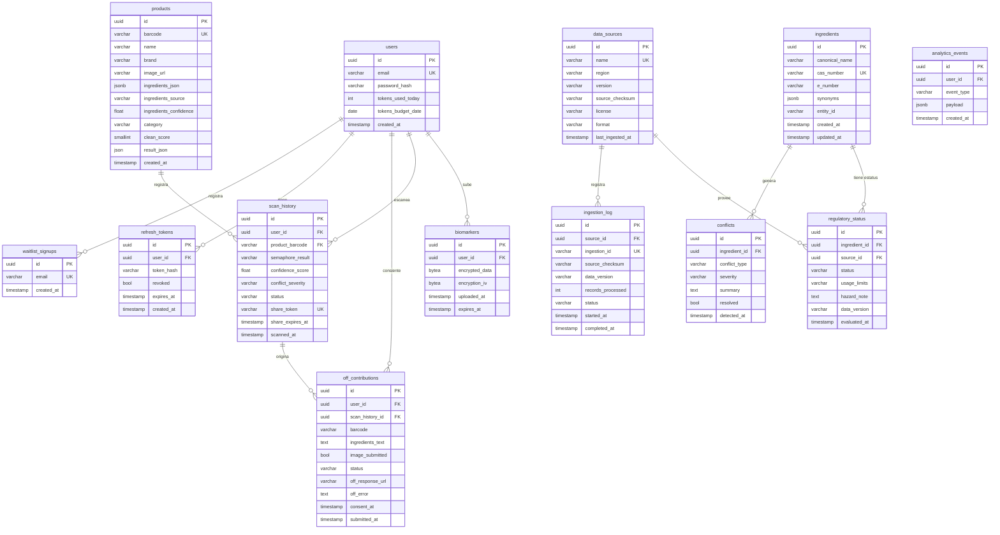

# BioShield AI — Arquitectura del Sistema

**Versión:** 2.0  
**Última actualización:** 2026-06-03  
**Generado desde:** code-review-graph (1,505 nodos, 12,338 aristas)

---

## Tabla de contenidos

1. [Visión general](#1-visión-general)
2. [Topología de capas](#2-topología-de-capas)
3. [Backend — FastAPI](#3-backend--fastapi)
4. [Pipeline de agente LangGraph](#4-pipeline-de-agente-langgraph)
5. [Frontend — Next.js](#5-frontend--nextjs)
6. [Flujos críticos end-to-end](#6-flujos-críticos-end-to-end)
7. [Seguridad](#7-seguridad)
8. [RAG y vector store](#8-rag-y-vector-store)
9. [Database schema](#9-database-schema)
10. [Pipeline de ingesta](#10-pipeline-de-ingesta)
11. [Observabilidad](#11-observabilidad)
12. [Infraestructura y despliegue](#12-infraestructura-y-despliegue)
13. [Testing](#13-testing)
14. [Comunidades y acoplamiento](#14-comunidades-y-acoplamiento)

---

## 1. Visión general

BioShield AI es un agente que:

1. **Escanea** etiquetas nutricionales (código de barras o foto).
2. **Detecta aditivos** ocultos mediante búsqueda semántica (RAG + ChromaDB).
3. **Cruza hallazgos** con los biomarcadores de sangre del usuario para personalizar el riesgo.
4. **Sugiere alternativas** más limpias del mismo catálogo de 16,000+ productos.

Invariantes globales:
- JWT obligatorio en todos los endpoints excepto `/auth/login`, `/auth/register`, `/auth/refresh`.
- Datos médicos encriptados AES-256-GCM antes de persistir — nunca plaintext.
- Biomarkers expiran en 180 días (`expires_at` validado en DB y en queries).
- Todo endpoint que llama a Gemini tiene `Depends(token_budget(...))` — verificado en `test_ci_gate.py`.
- Config solo desde `backend/app/config.py` (Pydantic Settings) — nunca `os.environ` directo.
- Todo HTTP del frontend pasa por `frontend/lib/api/client.ts` — nunca `fetch()` en componentes.

---

## 2. Topología de capas

```
┌───────────────────────────────────────────────────────────────────┐
│  Browser / Mobile                                                  │
│  Next.js 16  (App Router)                                         │
│  Tailwind CSS v4 · shadcn/ui · TanStack Query                     │
└─────────────────────────┬─────────────────────────────────────────┘
                          │ HTTPS  (JWT en HttpOnly cookie)
┌─────────────────────────▼─────────────────────────────────────────┐
│  FastAPI (Python 3.11+)                                            │
│  Middleware: JWT auth · Rate limit · Security headers · Logging   │
│  Routers:  /auth  /scan  /biosync  /analytics  /waitlist          │
│  Dependencies: token_budget · get_current_user                    │
└───────┬────────────┬──────────────┬────────────────┬──────────────┘
        │            │              │                │
    LangGraph    Gemini API    ChromaDB         SQLAlchemy
    scan agent   (Flash 2.5)   (vectors)        ORM 2.0
        │                          │                │
    LangGraph                  BGE-M3 /        SQLite (dev)
    nodes: 7                gemini-emb-001     PostgreSQL (prod)
```

---

## 3. Backend — FastAPI

### 3.1 Estructura de directorios

```
backend/
├── app/
│   ├── main.py                  # entrypoint; monta routers; middleware
│   ├── config.py                # Pydantic Settings — única fuente de config
│   ├── agents/
│   │   ├── graph.py             # build_scan_graph() — construye el DAG LangGraph
│   │   ├── nodes.py             # 7 nodos del agente (factories)
│   │   ├── state.py             # ScanState (TypedDict) — estado compartido del agente
│   │   ├── accumulator.py       # ScanStateAccumulator — acumula eventos SSE
│   │   └── prompts.py           # constantes de prompt — importadas en nodes.py
│   ├── core/
│   │   ├── context.py           # contextvars: REQUEST_ID_VAR
│   │   ├── priorities.py        # prioridades de scanning (enum)
│   │   └── semaphore.py         # semáforo GREEN/YELLOW/RED
│   ├── dependencies/
│   │   └── token_budget.py      # token_budget() — Depends() guard para LLM endpoints
│   ├── middleware/
│   │   ├── auth.py              # JWTAuthMiddleware
│   │   ├── logging.py           # RequestIDMiddleware + JSON logging
│   │   └── rate_limit.py        # SlowAPI rate limiter por IP/usuario
│   ├── models/
│   │   ├── __init__.py          # SQLAlchemy ORM: User, Product, Biomarker,
│   │   │                        #   ScanHistory, Ingredient, RegulatoryStatus,
│   │   │                        #   Conflict, DataSource, IngestionLog,
│   │   │                        #   OffContribution, RefreshToken, WaitlistSignup
│   │   ├── base.py              # Base declarativa
│   │   └── off_contribution.py  # OffContribution model
│   ├── routers/
│   │   ├── auth.py              # /auth/register, /login, /logout, /refresh, /me
│   │   ├── scan.py              # /scan/barcode, /scan/photo, /scan/{id}, share
│   │   ├── biosync.py           # /biosync/extract, /biosync/upload, /biosync/status
│   │   ├── analytics.py         # /analytics/events
│   │   └── waitlist.py          # /waitlist/signup
│   ├── schemas/
│   │   ├── models.py            # Pydantic v2 schemas — espejados en frontend/lib/api/types.ts
│   │   └── errors.py            # ErrorResponse schema
│   └── services/
│       ├── auth.py              # hash_password, create_access_token,
│       │                        #   create_refresh_token, validate_and_rotate_refresh_token
│       ├── crypto.py            # encrypt_biomarker / decrypt_biomarker (AES-256-GCM)
│       ├── gemini.py            # cliente Gemini 2.5 Flash:
│       │                        #   analyze_label(), extract_biomarkers_from_pdf(),
│       │                        #   parse_ingredients_ocr()
│       ├── embeddings.py        # get_embedder() — gemini-embedding-001 + fallback BGE-M3
│       ├── rag.py               # query_rag(), build_product_profile()
│       ├── retrieval.py         # ChromaDB retrieval helpers
│       ├── entity_resolution.py # EntityResolutionLayer (ERL 2.0) — CAS/E-number matching
│       ├── analysis.py          # semaphore logic + risk scoring
│       ├── conflicts.py         # ConflictDetector — REGULATORY/SCIENTIFIC/TEMPORAL
│       ├── alternatives.py      # AlternativeFinder — ChromaDB products collection
│       ├── enrichment.py        # enrich_product(), build_product_profile()
│       ├── off_client.py        # Open Food Facts API client
│       ├── biomarker_ranges.py  # resolve_range(), classify() — rangos clínicos
│       ├── biomarker_rules.py   # BIOMARKER_RULES corpus — reglas clínicas estáticas
│       ├── maintenance.py       # cron helpers: expire_biomarkers
│       └── ingestion/
│           ├── common.py        # helpers compartidos de ingesta
│           ├── codex_gsfa.py    # Codex GSFA ingestor
│           ├── efsa_zenodo.py   # EFSA OpenFoodTox ingestor
│           └── fda_eafus.py     # FDA EAFUS ingestor
├── alembic/                     # migraciones (13 versiones al 2026-06-03)
├── scripts/                     # scripts de ingesta + utilidades offline
└── tests/                       # pytest (42+ archivos de test)
```

### 3.2 Middleware stack (orden de ejecución)

```
Request → RequestIDMiddleware (UUID) → RateLimitMiddleware → JWTAuthMiddleware
       → Router handler
Response → add_security_headers (CSP, HSTS, X-Frame-Options, etc.)
```

### 3.3 Routers y endpoints

| Router | Prefijo | Endpoints clave |
|--------|---------|-----------------|
| `auth.py` | `/auth` | `POST /register`, `POST /login`, `POST /logout`, `POST /refresh`, `GET /me` |
| `scan.py` | `/scan` | `POST /scan/barcode` (SSE), `POST /scan/photo` (SSE), `GET /scan/{id}`, `POST /scan/{id}/share`, `GET /scan/share/{token}` |
| `biosync.py` | `/biosync` | `POST /biosync/extract` (PDF→biomarkers), `POST /biosync/upload`, `GET /biosync/status` |
| `analytics.py` | `/analytics` | `POST /analytics/events` |
| `waitlist.py` | `/waitlist` | `POST /waitlist/signup` |

### 3.4 Dependencies

- **`get_current_user`** — decodifica JWT del header `Authorization: Bearer` o cookie `access_token`; retorna `User` o lanza 401.
- **`token_budget(cost: int)`** — verifica que el usuario no haya excedido `DAILY_TOKEN_BUDGET` (default 50,000 tokens). Reset inline al cambiar de día (sin cron). Obligatorio en todo endpoint Gemini — verificado en `test_ci_gate.py`.

---

## 4. Pipeline de agente LangGraph

### 4.1 Grafo de ejecución

`build_scan_graph()` en `agents/graph.py` construye un StateGraph LangGraph con 7 nodos:

```
identify_product ──► extract_ingredients ──► resolve_entities
                                                    │
                               ┌────────────────────┤
                               ▼                    ▼
                     search_regulatory         biosync_node
                               │                    │
                               └────────┬───────────┘
                                        ▼
                              detect_conflicts
                                        │
                                        ▼
                              calculate_risk
                                        │
                                        ▼
                               personalize_node
```

### 4.2 Nodos y responsabilidades

| Nodo (factory en `nodes.py`) | Función | LLM? |
|------------------------------|---------|------|
| `make_identify_product_node` | lookup en OFF o extrae nombre/marca de foto | No (OFF API) |
| `make_extract_ingredients_node` | Gemini extrae lista de ingredientes del label | Sí |
| `make_resolve_entities_node` | ERL 2.0: mapea nombres → CAS/E-number canónico | No (DB + ChromaDB) |
| `make_search_regulatory_node` | RAG sobre ChromaDB `ingredients` | No (vector search) |
| `make_biosync_node` | carga biomarkers del usuario y aplica reglas clínicas | No |
| `make_detect_conflicts_node` | detecta conflictos REGULATORY/SCIENTIFIC/TEMPORAL | No |
| `make_calculate_risk_node` | calcula semáforo + score de riesgo | No (reglas) |
| `make_personalize_node` | genera insights personalizados con biomarkers | Sí |

### 4.3 Estado del agente

`ScanState` (TypedDict en `agents/state.py`):

```python
class ScanState(TypedDict):
    product_id: str
    ingredients: list[str]
    resolved_entities: list[ResolvedEntity]
    regulatory_hits: list[RegulatoryHit]
    biomarkers: list[Biomarker] | None
    conflicts: list[Conflict]
    semaphore: Literal["GREEN", "YELLOW", "RED"]
    risk_score: float
    personalized_insights: list[str]
    # streaming
    events: list[ScanEvent]
```

### 4.4 Streaming SSE

Los endpoints `/scan/barcode` y `/scan/photo` retornan `StreamingResponse` (SSE). El helper `_event_stream()` en `routers/scan.py` itera sobre el generador LangGraph, serializa cada evento con `_serialize()`, y lo emite como `data: {...}\n\n`. Al terminar:

1. `_upsert_product()` — crea o actualiza `Product` en DB.
2. `_create_pending_row()` — inserta `ScanHistory` con `status=pending`.
3. `_finalize_scan_history()` — actualiza a `status=done` + persiste `result_json`.
4. Si falla: `_mark_scan_failed()`.
5. `BackgroundTask` dispara `_run_enrich_task()` asíncronamente.

---

## 5. Frontend — Next.js

### 5.1 Estructura de rutas (App Router)

```
app/
├── layout.tsx                   # root layout: providers, fonts
├── providers.tsx                # QueryClientProvider + AuthProvider
├── (marketing)/
│   ├── layout.tsx               # marketing shell
│   └── page.tsx                 # LandingPage (scrollytelling 4-beat)
├── (auth)/
│   ├── login/page.tsx           # LoginPage
│   ├── register/page.tsx        # RegisterPage
│   ├── privacy/page.tsx
│   └── terms/page.tsx
├── (app)/
│   ├── layout.tsx               # AppLayout: BottomNav + SessionExpiredDialog
│   ├── home/page.tsx            # DashboardPage
│   ├── scan/
│   │   ├── page.tsx             # ScanPage (cámara / input barcode)
│   │   └── [id]/
│   │       ├── page.tsx         # ScanResultPage (consume SSE + TanStack Query)
│   │       └── alternatives/page.tsx  # AlternativesPage
│   ├── biosync/page.tsx         # BiosyncPage (upload PDF)
│   └── history/page.tsx         # HistoryPage
├── scan/share/[token]/page.tsx  # share link público (no requiere auth)
└── api/og/route.tsx             # Open Graph image generation
```

### 5.2 Componentes clave (`frontend/components/`)

| Componente | Rol |
|------------|-----|
| `AILoadingState.tsx` | Avatar animado durante stream SSE |
| `AlternativeRow / TopPick / HeroPanel / RankingList` | UI de alternativas |
| `AvatarGlow.tsx` | Orbe animado del dashboard |
| `BottomNav.tsx` | Navegación mobile (oculto en desktop) |
| `SessionExpiredDialog.tsx` | Modal cuando JWT expira (intercepta 401) |
| `Skeletons.tsx` | Loading states: SkeletonCard, SkeletonHero, SkeletonRow |
| `auth/LoginForm / RegisterForm` | Formularios de autenticación |

### 5.3 HTTP layer

Toda petición HTTP pasa por `frontend/lib/api/client.ts`:
- Inyecta `Authorization: Bearer <token>` desde cookie/localStorage.
- Intercepta 401 → dispara `SessionExpiredDialog`.
- Tipos de request/response espejados desde `backend/app/schemas/models.py` en `frontend/lib/api/types.ts`.

### 5.4 State management

- **TanStack Query** — server state (scans, historial, biomarkers). Todo acceso pasa por `frontend/hooks/`:
  - `hooks/use-auth.ts` — `useLogin`, `useRegister` (register + auto-login en un solo mutation), `useLogout` (con `cancelQueries → removeQueries` en logout)
  - `hooks/use-biosync.ts` — `useBiomarkerStatus`, `useExtractBiomarkers`, `useUploadBiomarkers`, `useDeleteBiomarkers`; key factory: `biosyncKeys`
  - `hooks/use-scan.ts` — `useScanResult`, `useScanHistory`, `useAlternatives`, `useSharedScan`, `useLinkPhotoToBarcode`, `useCreateShareLink`, `useRevokeShareLink`, `useContributeToOff`; key factory: `scanKeys`
  - `hooks/use-analytics.ts` — `useRecordAnalyticsEvent` (fire-and-forget)
- **Invariante:** ninguna página o componente instancia `useQuery`/`useMutation` de `@tanstack/react-query` directamente — siempre a través de hooks.
- **Zustand** — client state: `lib/stores/auth.ts` (user, isAuthenticated), `lib/stores/scanning.ts` (SSE stream state).
- **`*Keys` factories** — fuente de verdad única para `queryKey`: `biosyncKeys.status()`; `scanKeys.result(id)`, `scanKeys.history(limit)`, `scanKeys.alternatives(barcode?)`, `scanKeys.shared(token)`.

---

## 6. Flujos críticos end-to-end

### 6.1 Registro de usuario (criticality 0.832 — más alto del sistema)

```
RegisterPage (frontend)
  → POST /auth/register
    → hash_password (bcrypt)
    → User INSERT
    → create_access_token + create_refresh_token
    → store_refresh_token (hash SHA-256 en DB)
    → _set_auth_cookies (HttpOnly: access_token, refresh_token)
    → AuthSuccessResponse
```

### 6.2 Scan por código de barras (criticality 0.691)

```
ScanPage → POST /scan/barcode (barcode: str)
  │ Depends: get_current_user, token_budget(cost=15000)
  │
  ├── build_scan_graph()                          [LangGraph DAG]
  │     identify_product → OFF lookup / DB cache
  │     extract_ingredients → Gemini Flash
  │     resolve_entities → ERL 2.0 (CAS matching)
  │     search_regulatory → ChromaDB query
  │     biosync_node → decrypt + load user biomarkers
  │     detect_conflicts → REGULATORY/SCIENTIFIC/TEMPORAL
  │     calculate_risk → semaphore + score
  │     personalize_node → Gemini (personalized insights)
  │
  ├── SSE stream → ScanResultPage consume eventos
  │
  ├── _upsert_product() → products table
  ├── _create_pending_row() → scan_history (status=pending)
  ├── _finalize_scan_history() → scan_history (status=done, result_json)
  │
  └── BackgroundTask → enrich_product()
        → ingredients_json, clean_score en products
        → re-index en ChromaDB products collection
```

### 6.3 Scan por foto (idéntico al barcode + cascada OFF)

El nodo `identify_product` añade 3 estrategias de fallback:
1. Gemini OCR extrae EAN → usa barcode directo.
2. `_run_off_lookup_task` → busca nombre+marca en OFF Search API.
3. CTA manual → `POST /scan/photo/{pseudo}/link` → `link_photo_to_barcode()`.

### 6.4 Upload de biomarkers (criticality 0.695)

```
BiosyncPage → POST /biosync/extract (PDF base64)
  │ Depends: get_current_user, token_budget(cost=8000)
  │
  ├── extract_biomarkers_from_pdf (Gemini vision)
  │     _to_gemini_schema → Structured Output
  │     _decode_base64_safe
  │     _extract_parsed → BiomarkerExtractionResult
  │
  ├── resolve_range() → rango clínico por biomarcador
  ├── classify() → LOW/NORMAL/HIGH/CRITICAL
  │
  └── POST /biosync/upload → encrypt_biomarker (AES-256-GCM)
        → Biomarker INSERT (encrypted_data, encryption_iv, expires_at = +180d)
```

### 6.5 Alternativas

```
ScanResultPage → GET /scan/{id}/alternatives
  → AlternativeFinder.find()
     → ChromaDB products collection
     → embedding del producto original (gemini-embedding-001)
     → similarity search (top-10, filtro clean_score < original)
     → sort por clean_score ASC
  → AlternativesPage renderiza ranking
```

---

## 7. Seguridad

### 7.1 Autenticación

| Mecanismo | Detalle |
|-----------|---------|
| **Tokens** | JWT HS256; access (15 min) + refresh (7 días) |
| **Storage** | HttpOnly cookies — inmunes a XSS |
| **Rotación** | `validate_and_rotate_refresh_token()`: refresh tokens son single-use; hash SHA-256 en DB |
| **Endpoints públicos** | Solo `/auth/login`, `/auth/register`, `/auth/refresh` |

### 7.2 Encriptación de datos médicos

- **Algoritmo:** AES-256-GCM vía `cryptography.hazmat.primitives.ciphers.aead.AESGCM`.
- **Key:** `AES_KEY` env var — 32 bytes ASCII exactos (256 bits); validada en `config.py`.
- **Funciones:** `encrypt_biomarker()` / `decrypt_biomarker()` en `services/crypto.py`.
- Los valores numéricos de biomarkers **nunca** se persisten en plaintext ni se embeddean.

### 7.3 Security headers (`main.py`)

```
Strict-Transport-Security: max-age=31536000; includeSubDomains
X-Content-Type-Options: nosniff
X-Frame-Options: DENY
Content-Security-Policy: default-src 'self'
Referrer-Policy: strict-origin-when-cross-origin
Permissions-Policy: camera=(), microphone=(), geolocation=()
```

### 7.4 Rate limiting

`SlowAPI` (wrapper de `limits`) en `middleware/rate_limit.py`:
- Por defecto: 60 req/min por IP para endpoints públicos.
- Endpoints LLM: 10 req/min por usuario autenticado.

### 7.5 Token budget

`token_budget(cost)` en `dependencies/token_budget.py`:
- Atomic `UPDATE users SET tokens_used_today = tokens_used_today + :cost WHERE id = :uid AND tokens_budget_date = CURRENT_DATE`.
- Si `tokens_used_today + cost > DAILY_TOKEN_BUDGET` → HTTP 429.
- Reset automático inline si `tokens_budget_date != CURRENT_DATE`.

---

## 8. RAG y vector store

### 8.1 ChromaDB collections

| Collection | Contenido | Dimensión | Embedder |
|------------|-----------|-----------|---------|
| `ingredients` | Texto canónico de ingredientes/aditivos con estatus regulatorio | 1024 | BGE-M3 (local) |
| `products` | Ingredient profiles (`build_product_profile()`) de 16,023 productos | 1024 | BGE-M3 (local) |

### 8.2 Embedder con fallback

`services/embeddings.py` — `get_embedder()`:
1. Intenta `gemini-embedding-001` (API).
2. Si falla o `USE_LOCAL_EMBEDDINGS=true` → carga BGE-M3 local (HuggingFace `BAAI/bge-m3`).

### 8.3 Fuentes de datos RAG (ingredients)

| Fuente | Región | Formato | Script |
|--------|--------|---------|--------|
| FDA EAFUS | US | HTML | `ingestion/fda_eafus.py` |
| EFSA OpenFoodTox (Zenodo) | EU | CSV | `ingestion/efsa_zenodo.py` |
| Codex GSFA | Global | XLSX | `ingestion/codex_gsfa.py` |

### 8.4 Entity Resolution Layer (ERL 2.0)

`services/entity_resolution.py` — mapea nombres de ingredientes de etiquetas a entidades canónicas:

1. **Exact match** → CAS number (confidence 1.0)
2. **E-number match** → (confidence 0.95)
3. **Synonym match** (JSONB array) → (confidence 0.85)
4. **Vector similarity** → ChromaDB `ingredients` (confidence ≤ 0.80)

`confidence_score` se persiste en `scan_history` para trazabilidad.

---

## 9. Database schema

### 9.1 Motor

| Entorno | Motor |
|---------|-------|
| Dev local | SQLite (`backend/bioshield.db`) |
| Producción | PostgreSQL |

Migraciones con **Alembic** (`backend/alembic/`) — 13 versiones al 2026-06-03.

### 9.2 Entidad-Relación


```mermaid
erDiagram
    users ||--o{ biomarkers : "sube"
    users ||--o{ scan_history : "escanea"
    users ||--o{ off_contributions : "consiente"
    users ||--o{ refresh_tokens : "tiene"
    users ||--o{ waitlist_signups : "registra"
    products ||--o{ scan_history : "registra"
    scan_history ||--o{ off_contributions : "origina"
    ingredients ||--o{ regulatory_status : "tiene estatus"
    ingredients ||--o{ conflicts : "genera"
    data_sources ||--o{ regulatory_status : "provee"
    data_sources ||--o{ ingestion_log : "registra"

    users {
        uuid id PK
        varchar email UK
        varchar password_hash
        int tokens_used_today
        date tokens_budget_date
        timestamp created_at
    }
    products {
        uuid id PK
        varchar barcode UK
        varchar name
        varchar brand
        varchar image_url
        jsonb ingredients_json
        varchar ingredients_source
        float ingredients_confidence
        varchar category
        smallint clean_score
        json result_json
        timestamp created_at
    }
    biomarkers {
        uuid id PK
        uuid user_id FK
        bytea encrypted_data
        bytea encryption_iv
        timestamp uploaded_at
        timestamp expires_at
    }
    scan_history {
        uuid id PK
        uuid user_id FK
        varchar product_barcode FK
        varchar semaphore_result
        float confidence_score
        varchar conflict_severity
        varchar status
        varchar share_token UK
        timestamp share_expires_at
        timestamp scanned_at
    }
    refresh_tokens {
        uuid id PK
        uuid user_id FK
        varchar token_hash
        bool revoked
        timestamp expires_at
        timestamp created_at
    }
    ingredients {
        uuid id PK
        varchar canonical_name
        varchar cas_number UK
        varchar e_number
        jsonb synonyms
        varchar entity_id
        timestamp created_at
        timestamp updated_at
    }
    regulatory_status {
        uuid id PK
        uuid ingredient_id FK
        uuid source_id FK
        varchar status
        varchar usage_limits
        text hazard_note
        varchar data_version
        timestamp evaluated_at
    }
    conflicts {
        uuid id PK
        uuid ingredient_id FK
        varchar conflict_type
        varchar severity
        text summary
        bool resolved
        timestamp detected_at
    }
    data_sources {
        uuid id PK
        varchar name UK
        varchar region
        varchar version
        varchar source_checksum
        varchar license
        varchar format
        timestamp last_ingested_at
    }
    ingestion_log {
        uuid id PK
        uuid source_id FK
        varchar ingestion_id UK
        varchar source_checksum
        varchar data_version
        int records_processed
        varchar status
        timestamp started_at
        timestamp completed_at
    }
    off_contributions {
        uuid id PK
        uuid user_id FK
        uuid scan_history_id FK
        varchar barcode
        text ingredients_text
        bool image_submitted
        varchar status
        varchar off_response_url
        text off_error
        timestamp consent_at
        timestamp submitted_at
    }
    analytics_events {
        uuid id PK
        uuid user_id FK
        varchar event_type
        jsonb payload
        timestamp created_at
    }
    waitlist_signups {
        uuid id PK
        varchar email UK
        timestamp created_at
    }
```

### 9.3 Índices clave

```sql
CREATE INDEX idx_products_barcode ON products(barcode);
CREATE INDEX idx_ingredients_cas ON ingredients(cas_number);
CREATE INDEX idx_ingredients_entity_id ON ingredients(entity_id);
CREATE INDEX idx_biomarkers_user ON biomarkers(user_id);
CREATE INDEX idx_biomarkers_expires ON biomarkers(expires_at);
CREATE INDEX idx_scan_history_user ON scan_history(user_id);
CREATE INDEX idx_scan_history_share_token ON scan_history(share_token);
CREATE INDEX idx_conflicts_unresolved ON conflicts(resolved) WHERE resolved = FALSE;
CREATE INDEX idx_reg_status_ingredient ON regulatory_status(ingredient_id);
```

---

## 10. Pipeline de ingesta

### 10.1 Ingesta offline (one-time setup)

```bash
cd backend

# Paso 1 — Fetch paralelo
python -m scripts.ingest_off_mexico   # → data/off_products.json
python -m scripts.ingest_off_global   # → data/off_global_products.json
python -m scripts.ingest_usda         # → data/usda_products.json (requiere USDA_API_KEY)

# Paso 2 — Carga a DB (skip si barcode ya existe)
python -m scripts.load_all_products

# Paso 3 — Scoring
python -m scripts.compute_clean_scores

# Paso 4 — Indexado ChromaDB (~30 min con BGE-M3)
python -m scripts.index_products_chroma --batch-size 500
```

**Resultado post-ejecución (2026-05-14):** 16,023 productos en DB — 431 OFF MX + 15,570 USDA + 22 legacy. 16,001 indexados en ChromaDB.

### 10.2 Fuentes y prioridades

| Script | Fuente | Prioridad | `ingredients_source` |
|--------|--------|-----------|---------------------|
| `ingest_off_mexico.py` | OFF Search API v2 (MX) | 1 (mayor) | `off_dump_mx` |
| `ingest_off_global.py` | OFF Search API v2 (global) | 2 | `off_global` |
| `ingest_usda.py` | USDA FoodData Central | 3 (menor) | `usda_branded` |

Deduplicación: skip si barcode ya existe (preserva fuente de mayor prioridad).

### 10.3 Enrichment pipeline (runtime)

Trigger: cada scan exitoso → `BackgroundTask` post-commit.

```
_run_enrich_task()
  → enrich_product()
       SELECT FOR UPDATE product
       if confidence >= 0.8:
         write ingredients_json, ingredients_source, clean_score
         if product.category:
           upsert en ChromaDB products collection
```

`build_product_profile()` en `rag.py` centraliza el formato del documento ChromaDB.

### 10.4 Expiración de biomarkers

Script `scripts/expire_biomarkers.py` — elimina rows donde `expires_at < NOW()`. Debe ejecutarse como cron job en producción (no hay background thread en el proceso FastAPI).

---

## 11. Observabilidad

### 11.1 Request IDs

`RequestIDMiddleware` genera `uuid4` por request → almacenado en:
- Header de respuesta `X-Request-ID`.
- `contextvars.ContextVar` (`REQUEST_ID_VAR`) propagado a services y background tasks.

### 11.2 JSON logging

`logging.config.dictConfig` en `main.py` — formato:
```json
{"ts": "2026-06-03T...", "level": "INFO", "logger": "app.routers.scan",
 "request_id": "...", "msg": "scan_complete", "semaphore": "RED"}
```

### 11.3 Métricas LLM

`services/gemini.py` emite `gemini_call_complete` con:
```json
{"event": "gemini_call_complete", "model": "gemini-2.5-flash",
 "tokens_prompt": 1200, "tokens_output": 340, "tokens_total": 1540}
```

### 11.4 Token budget tracking

`users.tokens_used_today` + `users.tokens_budget_date` — actualizados atómicamente en cada llamada Gemini. Visible via `GET /auth/me`.

### 11.5 Per-Node Latency Instrumentation

`backend/app/agents/timing.py` — wrapper `timed_node` que instrumenta cada nodo del pipeline
con `time.perf_counter()` y emite logs estructurados:

```json
{"ts": "...", "level": "INFO", "logger": "app.agents.timing",
 "request_id": "...", "msg": "node_timing", "node": "biosync", "elapsed_ms": 142.3}
{"ts": "...", "level": "WARNING", "logger": "app.agents.timing",
 "request_id": "...", "msg": "slow_node", "node": "identify_product",
 "elapsed_ms": 9200.0, "threshold_ms": 8000}
```

**Comportamiento clave:**
- `finally` + `success` flag: el log de timing se emite siempre, incluyendo en paths de error
  y `CancelledError`. `slow_node` WARNING solo se emite en happy path.
- `_is_timed = True` sentinel en el wrapper (no `__wrapped__`) — exclusivo de `timed_node`,
  permite que el CI gate verifique instrumentación sin falsos positivos.
- Correlation: `request_id` llega automáticamente vía `RequestIDMiddleware` ContextVar →
  `JsonFormatter`. No se requiere campo extra en `ScanState`.
- Feature flag: `Settings.enable_node_timing` (default `True`) — `False` retorna el callable
  original sin wrap. Configurable vía `ENABLE_NODE_TIMING` sin redeploy.

**Thresholds** (`SLOW_NODE_THRESHOLDS`): placeholders actuales — Gemini Vision nodes (8000ms),
resto (2000ms). Deben actualizarse a P95+20% con ≥20 scans representativos antes del merge
a main (ver módulo docstring en `timing.py`).

**CI gate:** `test_ci_gate.py::test_all_nodes_are_timed` — verifica bidireccionalmente que
todos los nodos de `build_scan_graph()` tienen `_is_timed`. Falla si se agrega un nodo
sin instrumentación o sin actualizar `EXPECTED_NODE_NAMES`.

---

## 12. Infraestructura y despliegue

### 12.1 Docker Compose (desarrollo)

```yaml
# docker-compose.yml
services:
  backend:   # FastAPI, puerto 8000, hot-reload
  frontend:  # Next.js, puerto 3000
  postgres:  # PostgreSQL 15, volumen persistente

# docker-compose.integration.yml (CI)
services:
  backend:   # + postgres real para tests de integración
  postgres:
```

### 12.2 Dockerfiles

- `backend/Dockerfile` — Python 3.11-slim, BuildKit cache (`--mount=type=cache`), healthcheck en `/health`.
- `frontend/Dockerfile` — Node 20-alpine, `pnpm`, output standalone.

### 12.3 GitHub Actions (`.github/workflows/`)

- **Build pipeline:** BuildKit cache habilitado (`DOCKER_BUILDKIT=1`).
- **CI gate:** `test_ci_gate.py` bloquea merge si hay endpoints LLM sin `token_budget`.

### 12.4 Variables de entorno requeridas

```env
# Backend (.env)
DATABASE_URL=sqlite:///./bioshield.db
SECRET_KEY=<jwt-secret>
ENCRYPTION_KEY=<fernet-key-base64>
GEMINI_API_KEY=<google-ai-key>
USDA_API_KEY=<usda-key>
DAILY_TOKEN_BUDGET=50000
CHROMA_PATH=./chroma_db
USE_LOCAL_EMBEDDINGS=false

# Frontend (.env.local)
NEXT_PUBLIC_API_URL=http://localhost:8000
```

---

## 13. Testing

### 13.1 Backend (pytest)

42+ archivos de test en `backend/tests/`. Categorías:

| Categoría | Archivos representativos |
|-----------|--------------------------|
| Auth | `test_auth.py`, `test_jwt_migration.py` |
| Scan pipeline | `test_scan.py`, `test_graph.py`, `test_accumulator.py` |
| Biosync | `test_biosync.py`, `test_crypto.py` |
| RAG/embeddings | `test_rag.py`, `test_embeddings.py`, `test_retrieval.py` |
| Ingesta | `test_ingest_off_global.py`, `test_ingest_usda.py` |
| Seguridad | `test_security_headers.py`, `test_phi_isolation.py`, `test_logging_redaction.py` |
| CI gate | `test_ci_gate.py` — verifica `token_budget` en todos los endpoints LLM |
| Config | `test_config.py`, `test_config_validation.py` |
| Schemas | `test_schemas_hardening.py`, `test_error_schema.py` |

### 13.2 E2E (Playwright)

Specs en `tests/specs/{feature}/` (raíz del repo):

```
tests/specs/
├── auth/
├── scan/
├── biosync/
├── dashboard/
└── history/
```

Config Playwright en `tests/` — nunca en `frontend/`.

### 13.3 Frontend (Vitest/Jest)

Tests unitarios en `frontend/` — fixtures y mocks en comunidad `fixtures-mock` (cohesión 0.358 — la más alta del codebase).

---

## 14. Comunidades y acoplamiento

Análisis del grafo de código (Leiden algorithm, 1,505 nodos, 12,338 aristas):

| Comunidad | Tamaño | Cohesión | Lenguaje | Descripción |
|-----------|--------|----------|----------|-------------|
| `tests-returns` | 478 | 0.203 | Python | Suite de tests backend — nodos más numerosos |
| `services-scan` | 257 | 0.165 | Python | Core del pipeline: services + routers + agents |
| `ui-dialog` | 130 | 0.116 | TSX | Componentes React (frontend/components/) |
| `scan-test:edge` | 103 | 0.055 | TypeScript | Tests de integración frontend |
| `id-page` | 80 | 0.123 | TSX | Páginas app (frontend/app/) |
| `scripts-fetch` | 62 | 0.064 | Python | Scripts de ingesta offline |
| `fixtures-mock` | 39 | **0.358** | TypeScript | Fixtures frontend — cohesión más alta |
| `tests-mock` | 36 | 0.039 | TypeScript | Tests frontend mock |
| `api-scan` | 30 | 0.130 | TypeScript | API client layer (frontend/lib/api/) |
| `versions-upgrade` | 28 | 0 | Python | Alembic migrations |

### 14.1 Advertencias de acoplamiento alto

| Par | Aristas | Tipos | Riesgo |
|-----|---------|-------|--------|
| `services-scan` ↔ `tests-returns` | 294 | CALLS, REFERENCES | Normal — tests cubren services |
| `id-page` ↔ `ui-dialog` | 61 | CALLS | Normal — páginas usan componentes |
| `ui-dialog` ↔ `api-scan` | 55 | CALLS | Watchear — componentes no deberían llamar API directo; verificar que pase por hooks |
| `services-scan` ↔ `scripts-fetch` | 62 | CALLS, REFERENCES | Scripts reusan servicios del core — aceptable |

### 14.2 Flows críticos por criticality score

| Flow | Criticality | Entry point | Archivo |
|------|-------------|-------------|---------|
| `register` | **0.832** | `register()` | `routers/auth.py:57` |
| `RegisterPage` | 0.815 | Frontend | `(auth)/register/page.tsx` |
| `LoginPage` | 0.795 | Frontend | `(auth)/login/page.tsx` |
| `login` | 0.770 | `login()` | `routers/auth.py` |
| `extract_biomarkers` | 0.703 | `extract_biomarkers()` | `routers/biosync.py:54` |
| `scan_barcode` | 0.691 | `scan_barcode()` | `routers/scan.py:184` |
| `scan_photo` | 0.691 | `scan_photo()` | `routers/scan.py` |
| `upload_biomarkers` | 0.695 | `upload_biomarkers()` | `routers/biosync.py:118` |

---

## Referencias cruzadas

- Estrategia de embeddings: `docs/embedding-strategy.md`
- Fuentes de datos RAG: `docs/data-sources.md`
- Prompt templates: `docs/prompts.md`
- Estrategia de contribución OFF: `docs/off-contribution.md`
- Runbooks: `docs/runbooks/`
- Specs de diseño: `docs/superpowers/specs/`
