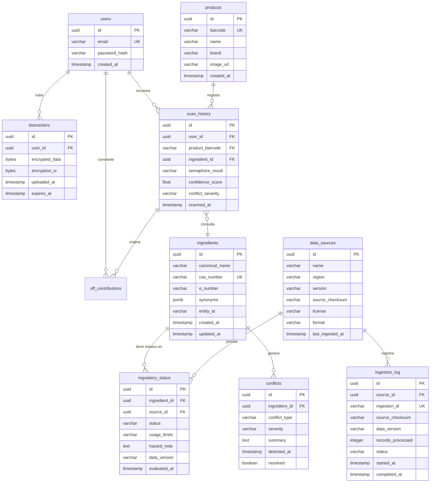

# 🏗️ BioShield AI — System Architecture

**Versión:** 1.0  
**Última actualización:** 2026-04-10

---

## 1. Database Schema

### 1.1 Motor de Base de Datos

| Entorno | Motor | Justificación |
|---|---|---|
| **Desarrollo local** | SQLite | Zero-config, ideal para iteración rápida |
| **Producción** | PostgreSQL (Render, plan gratuito) | Soporte nativo para JSON, cifrado, y concurrencia |

---

### 1.2 Diagrama Entidad-Relación


```mermaid
erDiagram
    users ||--o{ biomarkers : "sube"
    users ||--o{ scan_history : "escanea"
    users ||--o{ off_contributions : "consiente"
    products ||--o{ scan_history : "registra"
    scan_history ||--o{ off_contributions : "origina"
    ingredients ||--o{ regulatory_status : "tiene estatus en"
    ingredients ||--o{ conflicts : "genera"
    data_sources ||--o{ regulatory_status : "provee"
    data_sources ||--o{ ingestion_log : "registra"
    scan_history }o--|| ingredients : "consulta"

    users {
        uuid id PK
        varchar email UK
        varchar password_hash
        timestamp created_at
    }

    products {
        uuid id PK
        varchar barcode UK
        varchar name
        varchar brand
        varchar image_url
        timestamp created_at
    }

    biomarkers {
        uuid id PK
        uuid user_id FK
        bytea encrypted_data
        bytes encryption_iv
        timestamp uploaded_at
        timestamp expires_at
    }

    scan_history {
        uuid id PK
        uuid user_id FK
        varchar product_barcode FK
        uuid ingredient_id FK
        varchar semaphore_result
        float confidence_score
        varchar conflict_severity
        timestamp scanned_at
    }

    data_sources {
        uuid id PK
        varchar name
        varchar region
        varchar version
        varchar source_checksum
        varchar license
        varchar format
        timestamp last_ingested_at
    }

    ingredients {
        uuid id PK
        varchar canonical_name
        varchar cas_number UK
        varchar e_number
        jsonb synonyms
        varchar entity_id
        timestamp created_at
        timestamp updated_at
    }

    regulatory_status {
        uuid id PK
        uuid ingredient_id FK
        uuid source_id FK
        varchar status
        varchar usage_limits
        text hazard_note
        varchar data_version
        timestamp evaluated_at
    }

    conflicts {
        uuid id PK
        uuid ingredient_id FK
        varchar conflict_type
        varchar severity
        text summary
        timestamp detected_at
        boolean resolved
    }

    ingestion_log {
        uuid id PK
        uuid source_id FK
        varchar ingestion_id UK
        varchar source_checksum
        varchar data_version
        integer records_processed
        varchar status
        timestamp started_at
        timestamp completed_at
    }
```

---

### 1.3 Definición de Tablas

#### `users`
Gestión de cuentas de usuario.

| Campo | Tipo | Restricción | Descripción |
|---|---|---|---|
| `id` | `UUID` | `PK, DEFAULT gen_random_uuid()` | Identificador único |
| `email` | `VARCHAR(255)` | `UNIQUE, NOT NULL` | Correo electrónico |
| `password_hash` | `VARCHAR(255)` | `NOT NULL` | Hash bcrypt de la contraseña |
| `created_at` | `TIMESTAMP` | `DEFAULT NOW()` | Fecha de registro |

---

#### `products`
Catálogo normalizado de productos escaneados. Evita duplicar datos de producto en cada fila de `scan_history`.

| Campo | Tipo | Restricción | Descripción |
|---|---|---|---|
| `id` | `UUID` | `PK` | Identificador único |
| `barcode` | `VARCHAR(50)` | `UNIQUE, NOT NULL` | Código de barras (EAN-13, UPC-A, etc.) |
| `name` | `VARCHAR(255)` | — | Nombre del producto (obtenido de Open Food Facts o Gemini OCR) |
| `brand` | `VARCHAR(255)` | — | Marca del producto |
| `image_url` | `VARCHAR(500)` | — | URL de la imagen del producto |
| `created_at` | `TIMESTAMP` | `DEFAULT NOW()` | Fecha del primer escaneo del producto |

---

#### `biomarkers`
Datos biométricos encriptados del usuario. Expiran en 180 días por política de privacidad.

| Campo | Tipo | Restricción | Descripción |
|---|---|---|---|
| `id` | `UUID` | `PK` | Identificador único |
| `user_id` | `UUID` | `FK → users.id, NOT NULL` | Usuario propietario |
| `encrypted_data` | `BYTEA` | `NOT NULL` | Datos cifrados con AES-256-GCM |
| `encryption_iv` | `BYTEA(16)` | `NOT NULL` | IV (Initialization Vector) del cifrado AES-256-GCM |
| `uploaded_at` | `TIMESTAMP` | `DEFAULT NOW()` | Fecha de carga |
| `expires_at` | `TIMESTAMP` | `NOT NULL` | Fecha de expiración (uploaded_at + 180 días) |

---

#### `scan_history`
Historial de escaneos de productos. Enriquecida con métricas de confianza del sistema ERL 2.0.

> Ref: `data-sources.md` §7 (Entity Resolution) y §8 (Conflict Detection)

| Campo | Tipo | Restricción | Descripción |
|---|---|---|---|
| `id` | `UUID` | `PK` | Identificador único |
| `user_id` | `UUID` | `FK → users.id, NOT NULL` | Usuario que escanea |
| `product_barcode` | `VARCHAR(50)` | `FK → products.barcode, NOT NULL` | Código de barras del producto |
| `ingredient_id` | `UUID` | `FK → ingredients.id` | Ingrediente consultado (nullable para escaneos multi-ingrediente) |
| `semaphore_result` | `VARCHAR(10)` | `NOT NULL` | Resultado semáforo: `GREEN`, `YELLOW`, `RED` |
| `confidence_score` | `FLOAT` | `CHECK (0.0 <= val <= 1.0)` | Confianza de la resolución de entidad (1.0 = Exact Match CAS) |
| `conflict_severity` | `VARCHAR(10)` | — | Severidad del conflicto detectado: `HIGH`, `MEDIUM`, `LOW`, o `NULL` |
| `scanned_at` | `TIMESTAMP` | `DEFAULT NOW()` | Fecha del escaneo |

---

#### `data_sources`
Registro maestro de fuentes de datos del RAG. Permite trazabilidad del linaje.

> Ref: `data-sources.md` §2 (Data Sources Inventory) y §4 (Canonical Data Model → `lineage`)

| Campo | Tipo | Restricción | Descripción |
|---|---|---|---|
| `id` | `UUID` | `PK` | Identificador único |
| `name` | `VARCHAR(100)` | `UNIQUE, NOT NULL` | Nombre de la fuente (ej. `FDA_EAFUS`, `EFSA_OpenFoodTox`, `Codex_GSFA`) |
| `region` | `VARCHAR(50)` | `NOT NULL` | Región regulatoria: `US`, `EU`, `GLOBAL` |
| `version` | `VARCHAR(50)` | — | Versión del dataset (ej. `FDA_EAFUS_2026_Q2`) |
| `source_checksum` | `VARCHAR(71)` | — | SHA-256 del archivo fuente (`sha256:7f83b...`) |
| `license` | `VARCHAR(50)` | — | Licencia de uso (ej. `Public Domain`, `CC BY 4.0`, `IGO`) |
| `format` | `VARCHAR(20)` | — | Formato del archivo: `XLSX`, `CSV`, `XML`, `HTML` |
| `last_ingested_at` | `TIMESTAMP` | — | Última fecha de ingesta exitosa |

---

#### `ingredients`
Tabla maestra de ingredientes/aditivos. Refleja el modelo canónico `ingredient_metadata`.

> Ref: `data-sources.md` §4 (Canonical Data Model → `ingredient_metadata`)

| Campo | Tipo | Restricción | Descripción |
|---|---|---|---|
| `id` | `UUID` | `PK` | Identificador único interno |
| `canonical_name` | `VARCHAR(255)` | `NOT NULL` | Nombre canónico (ej. `Titanium Dioxide`) |
| `cas_number` | `VARCHAR(20)` | `UNIQUE` | Número CAS (ej. `13463-67-7`) |
| `e_number` | `VARCHAR(10)` | — | Número E europeo (ej. `E171`) |
| `synonyms` | `JSONB` | `DEFAULT '[]'` | Lista de sinónimos (ej. `["Titania", "Pigment White 6"]`) |
| `entity_id` | `VARCHAR(50)` | — | ID canónico del modelo (ej. `CAS:13463-67-7`) |
| `created_at` | `TIMESTAMP` | `DEFAULT NOW()` | Fecha de creación |
| `updated_at` | `TIMESTAMP` | `DEFAULT NOW()` | Última actualización |

---

#### `regulatory_status`
Estatus regulatorio de un ingrediente **por fuente/agencia**. Permite detectar discrepancias.

> Ref: `data-sources.md` §8 (Conflict Detection) — Un ingrediente puede estar `Approved` en FDA y `Banned` en EFSA.

| Campo | Tipo | Restricción | Descripción |
|---|---|---|---|
| `id` | `UUID` | `PK` | Identificador único |
| `ingredient_id` | `UUID` | `FK → ingredients.id, NOT NULL` | Ingrediente evaluado |
| `source_id` | `UUID` | `FK → data_sources.id, NOT NULL` | Fuente que emitió el estatus |
| `status` | `VARCHAR(20)` | `NOT NULL` | Estatus: `Approved`, `Banned`, `Restricted`, `Under Review` |
| `usage_limits` | `VARCHAR(255)` | — | Límites de uso (ej. `1% max concentration`) |
| `hazard_note` | `TEXT` | — | Nota de riesgo (ej. `Genotoxicity Positive`) |
| `data_version` | `VARCHAR(50)` | — | Versión del dato fuente (ej. `2026.04.10`) |
| `evaluated_at` | `TIMESTAMP` | — | Fecha de la evaluación regulatoria |

**Constraint único:** `UNIQUE(ingredient_id, source_id)` — Un ingrediente tiene un solo estatus por fuente.

---

#### `conflicts`
Registro de discrepancias detectadas entre fuentes regulatorias.

> Ref: `data-sources.md` §8 (Conflict Detection 2.0) — Matriz de severidad: REGULATORY / SCIENTIFIC / TEMPORAL.

| Campo | Tipo | Restricción | Descripción |
|---|---|---|---|
| `id` | `UUID` | `PK` | Identificador único |
| `ingredient_id` | `UUID` | `FK → ingredients.id, NOT NULL` | Ingrediente con conflicto |
| `conflict_type` | `VARCHAR(20)` | `NOT NULL` | Tipo: `REGULATORY`, `SCIENTIFIC`, `TEMPORAL` |
| `severity` | `VARCHAR(10)` | `NOT NULL` | Severidad: `HIGH`, `MEDIUM`, `LOW` |
| `summary` | `TEXT` | `NOT NULL` | Descripción del conflicto (ej. `Banned in EU (EFSA); Approved in US (FDA)`) |
| `detected_at` | `TIMESTAMP` | `DEFAULT NOW()` | Fecha de detección |
| `resolved` | `BOOLEAN` | `DEFAULT FALSE` | Si el conflicto ha sido revisado/resuelto |

---

#### `ingestion_log`
Log de ejecuciones del pipeline de ingesta. Garantiza trazabilidad completa.

> Ref: `data-sources.md` §4 (Canonical Data Model → `lineage.ingestion_id`, `timestamp`)

| Campo | Tipo | Restricción | Descripción |
|---|---|---|---|
| `id` | `UUID` | `PK` | Identificador único |
| `source_id` | `UUID` | `FK → data_sources.id, NOT NULL` | Fuente procesada |
| `ingestion_id` | `VARCHAR(100)` | `UNIQUE, NOT NULL` | Hash de la ingesta (ej. `ingest_hash_98234db`) |
| `source_checksum` | `VARCHAR(71)` | `NOT NULL` | SHA-256 del archivo procesado |
| `data_version` | `VARCHAR(50)` | `NOT NULL` | Versión del dataset (ej. `2026.04.10`) |
| `records_processed` | `INTEGER` | — | Número de registros procesados |
| `status` | `VARCHAR(20)` | `NOT NULL` | Estado: `SUCCESS`, `PARTIAL`, `FAILED` |
| `started_at` | `TIMESTAMP` | `NOT NULL` | Inicio de la ejecución |
| `completed_at` | `TIMESTAMP` | — | Fin de la ejecución |

---

#### `off_contributions` (Fase 2)

Audit trail de contribuciones a Open Food Facts. Registra el consentimiento explícito del usuario (ODbL) y el resultado de cada envío al API write de OFF.

> Ref: PRD §9.6 (Flujo de contribución), `docs/off-contribution.md`

| Campo | Tipo | Restricción | Descripción |
|---|---|---|---|
| `id` | `UUID` | `PK` | Identificador único |
| `user_id` | `UUID` | `FK → users.id, NOT NULL, ON DELETE CASCADE` | Usuario que consintió |
| `scan_history_id` | `UUID` | `FK → scan_history.id, NULLABLE, ON DELETE SET NULL` | Scan origen (nullable) |
| `barcode` | `VARCHAR(50)` | `NOT NULL` | Code enviado a OFF (puede ser `photo:<hex>`) |
| `ingredients_text` | `TEXT` | `NOT NULL` | Texto exacto enviado en `ingredients_text` |
| `image_submitted` | `BOOLEAN` | `DEFAULT FALSE` | Si se subió imagen al endpoint separado |
| `status` | `VARCHAR(20)` | `NOT NULL, DEFAULT 'PENDING'` | Estado: `PENDING`, `SUBMITTED`, `FAILED` |
| `off_response_url` | `VARCHAR(500)` | — | URL del producto en OFF post-submit |
| `off_error` | `TEXT` | — | Mensaje de error si `status=FAILED` |
| `consent_at` | `TIMESTAMP` | `NOT NULL` | Cuándo el usuario consintió |
| `submitted_at` | `TIMESTAMP` | — | Cuándo el BackgroundTask terminó |

---

### 1.4 Índices Recomendados

```sql
-- Búsqueda de productos por barcode
CREATE INDEX idx_products_barcode ON products(barcode);

-- Búsqueda de ingredientes por identificador regulatorio
CREATE INDEX idx_ingredients_cas ON ingredients(cas_number);
CREATE INDEX idx_ingredients_e_number ON ingredients(e_number);
CREATE INDEX idx_ingredients_entity_id ON ingredients(entity_id);

-- Consultas frecuentes por usuario
CREATE INDEX idx_biomarkers_user ON biomarkers(user_id);
CREATE INDEX idx_scan_history_user ON scan_history(user_id);
CREATE INDEX idx_scan_history_barcode ON scan_history(product_barcode);

-- Búsqueda de estatus por ingrediente y fuente
CREATE INDEX idx_reg_status_ingredient ON regulatory_status(ingredient_id);
CREATE INDEX idx_reg_status_source ON regulatory_status(source_id);

-- Conflictos activos
CREATE INDEX idx_conflicts_ingredient ON conflicts(ingredient_id);
CREATE INDEX idx_conflicts_unresolved ON conflicts(resolved) WHERE resolved = FALSE;

-- Logs de ingesta por fuente
CREATE INDEX idx_ingestion_source ON ingestion_log(source_id);

-- OFF contributions (Fase 2)
CREATE INDEX idx_off_contrib_user ON off_contributions(user_id);
CREATE INDEX idx_off_contrib_status ON off_contributions(status);
```

---

### 1.5 Notas de Implementación

- **Migraciones:** El schema se gestiona con **Alembic** (`alembic/` directory). Las migraciones se generan con autogenerate desde los ORM models de SQLAlchemy. Ver `backend/CLAUDE.md` para los comandos.
- **Cifrado:** Los datos de `biomarkers.encrypted_data` se cifran con **AES-256-GCM** a nivel de aplicación antes de almacenarse; `encryption_iv` es obligatorio.
- **Expiración:** Un job programado (cron) eliminará registros de `biomarkers` donde `expires_at < NOW()`.
- **Vector Store:** Los embeddings se almacenan en **ChromaDB** (ver `data-sources.md` §9), **no** en PostgreSQL. La relación entre `ingredients.entity_id` y el vector store es por referencia lógica. **Dimensión: 1024** (BGE-M3 local). Los valores numéricos de los biomarcadores del usuario nunca se embeddean — solo el texto canónico de la regla clínica (código estático, sin PHI).
- **OFF Audit Trail:** La tabla `off_contributions` registra cada contribución a Open Food Facts con consentimiento explícito (PRD §9.6, ODbL). Aunque el POST a OFF es fire-and-forget asíncrono, el audit log local permite cumplimiento de ODbL y debugging.
- **Migración MVP → Producción:** El schema es compatible con SQLite (desarrollo) y PostgreSQL (producción). Los tipos `UUID` y `JSONB` se adaptan a `TEXT` y `JSON` respectivamente en SQLite; `render_as_batch=True` en Alembic maneja ALTER TABLE en SQLite.

---

## 2. Fase 2 — Extensiones de Schema

### 2.1 Campos nuevos en `products`

| Campo | Tipo | Descripción |
|---|---|---|
| `category` | `VARCHAR(100)` | Categoría OFF (ej. `"yogurts"`, `"bebidas"`). `NULL` para productos foto-scaneados sin categoría. |
| `clean_score` | `SMALLINT DEFAULT 0` | Número de ingredientes problemáticos detectados. **Menor = más limpio.** 0 = cero ingredientes flaggeados. Pre-computado en curation via `scripts/compute_clean_scores.py`. |

Índices: `idx_products_category`, `idx_products_clean_score`.

### 2.2 Nueva tabla `analytics_events`

| Campo | Tipo | Descripción |
|---|---|---|
| `id` | `UUID PK` | Identificador único |
| `user_id` | `UUID FK → users.id` | Usuario que generó el evento |
| `event_type` | `VARCHAR(50)` | `alt_button_shown` / `alt_page_opened` / `alt_tapped` |
| `payload` | `JSONB` | Contexto adicional (barcode, semaphore, etc.) |
| `created_at` | `TIMESTAMP` | Timestamp del evento |

### 2.3 Nueva ChromaDB collection: `products`

Separada de la collection `ingredients`. Cada documento es el ingredient profile de un producto curado. Dimensión: 1024 (BGE-M3, consistente con `ingredients`).

**Pipeline de ingesta:** `scripts/compute_clean_scores.py` → `scripts/index_products_chroma.py`

**Nota:** `scan_history.result_json` (migration `a3f7c2d1e845`) ya existe — Fase 2 lo consume para extraer `flagged_ingredients[]` sin re-correr el pipeline.

### 2.4 Pipeline de Ingesta Híbrida (Fase 2.1)

Pipeline offline multi-fuente. **Resultado post-ejecución (2026-05-14): 16,023 productos en DB — 431 OFF MX + 15,570 USDA + 22 legacy. 16,001 indexados en ChromaDB.**

**Scripts de ingesta (ejecutar una vez, sin cambios en runtime):**

| Script | Fuente | Salida JSON | Prioridad |
|---|---|---|---|
| `scripts/ingest_off_mexico.py` | OFF Search API v2 (MX + health categories) | `scripts/data/off_products.json` | 1 (mayor) — `ingredients_source = "off_dump_mx"` |
| `scripts/ingest_off_global.py` | OFF Search API v2 (global, sin filtro de país, 25 categorías) | `scripts/data/off_global_products.json` | 2 — filtro `labels_tags: en:organic,en:no-additives`; `ingredients_source = "off_global"` |
| `scripts/ingest_usda.py` | USDA FoodData Central API (Branded Foods, 8 categorías) | `scripts/data/usda_products.json` | 3 (menor) — requiere `USDA_API_KEY`; `ingredients_source = "usda_branded"` |
| `scripts/load_all_products.py` | Los 3 JSON anteriores | Tabla `products` | — script canónico, skip si barcode ya existe |
| `scripts/load_products_to_db.py` | `off_products.json` | Tabla `products` | **Deprecated** — solo OFF MX, mantenido por compatibilidad |
| `scripts/compute_clean_scores.py` | Tabla `products` | Tabla `products` (clean_score) | — |
| `scripts/index_products_chroma.py` | Tabla `products` | ChromaDB `products` | — embeddings BGE-M3, upsert idempotente |

**Orden de ejecución completo:**

```bash
cd backend

# Paso 1 — Fetch (pueden correr en paralelo)
python -m scripts.ingest_off_mexico
python -m scripts.ingest_off_global
python -m scripts.ingest_usda          # requiere USDA_API_KEY en .env

# Paso 2 — Carga a DB (requiere los tres JSON)
python -m scripts.load_all_products

# Paso 3 — Scoring
python -m scripts.compute_clean_scores

# Paso 4 — Indexado ChromaDB (BGE-M3, ~30 min sobre 16k productos)
# Soporta batches para evitar OOM:
python -m scripts.index_products_chroma --batch-size 500 --offset 0
python -m scripts.index_products_chroma --batch-size 500 --offset 500
# ... continuar hasta cubrir el total (ver log "Quedan X productos")
# Sin args: procesa todo de una vez (puede fallar por memoria en catálogos grandes)
python -m scripts.index_products_chroma
```

**Variables de entorno requeridas:**

```env
USDA_API_KEY=<key gratuita de https://fdc.nal.usda.gov/api-guide.html>
# DEMO_KEY funciona para desarrollo con rate limit (~3 req/s)
```

**Estrategia de deduplicación:**
- `load_all_products.py` procesa fuentes en orden MX → Global → USDA. Si un barcode ya existe en DB, la inserción se **omite** (skip) — preserva la fuente de mayor prioridad.
- `index_products_chroma.py` usa upsert — idempotente, safe para re-ejecuciones parciales.

**Nota sobre OFF Global (Fase 2.1):** Con el filtro `labels_tags: en:organic,en:no-additives`, OFF Global retornó mayormente los mismos barcodes que OFF México. Los 15,570 productos nuevos son 100% USDA. OFF Global aportó 0 productos netos únicos. Para mayor yield, considerar relajar o eliminar el filtro `labels_tags` en futuras corridas.

**Función compartida: `build_product_profile()` en `rag.py`**

Centraliza la generación de ingredient profiles para ChromaDB:
```python
def build_product_profile(product: Product) -> str:
    """Genera: 'nombre: X | marca: Y | categoría: Z | clean_score: N [| ingredientes: ...]'"""
```
Usada por:
- `enrichment.py` — post-scan, cuando un producto nuevo se enriquece
- `index_products_chroma.py` — bulk indexing

---

### 2.5 Backup y Restauración de la Ingesta

Los archivos de DB y vectores **no están en git** (`.gitignore`). Crear un backup después de cada pipeline completo evita re-ejecutar el proceso (~45–60 min en total con BGE-M3 local).

**Archivos a respaldar:**

| Archivo | Tamaño aprox. | Contenido |
|---|---|---|
| `backend/bioshield.db` | ~13 MB | SQLite con los 16k productos + clean_scores |
| `backend/chroma_db/` | ~200 MB | Vectores BGE-M3 (1024-dim) de los 16k productos |

**Crear backup:**

```bash
cd backend
tar -czf ~/Desktop/bioshield_ingestion_backup_$(date +%Y-%m-%d).tar.gz \
    bioshield.db chroma_db/
# Resultado: ~145 MB comprimido
```

**Restaurar en otro equipo:**

```bash
# 1. Clonar el repo y configurar el venv normalmente
# 2. Copiar el backup al equipo destino
# 3. Extraer en backend/
tar -xzf bioshield_ingestion_backup_YYYY-MM-DD.tar.gz \
    -C /ruta/al/proyecto/backend/
# El servidor ya puede arrancar con los datos listos — no se requiere re-indexar
```

**Nota:** Si solo se restaura `bioshield.db` (sin `chroma_db/`), el motor de alternativas no funcionará hasta re-ejecutar `index_products_chroma.py`.

---

## 3. Enrichment Pipeline

El pipeline de enriquecimiento convierte cada scan exitoso en una contribución automática al curated DB.

**Trigger:** `POST /scan/barcode` y `POST /scan/photo` — disparan `BackgroundTask` después de `db.commit()`.

**Flujo:**
1. `_run_enrich_task` abre `SessionLocal()` propio (sesión del request ya cerrada).
2. `enrich_product()` aplica `SELECT FOR UPDATE` — first-write-wins, compatible SQLite + PostgreSQL.
3. Si `avg_confidence < 0.8`, la escritura se descarta.
4. Escribe `ingredients_json`, `ingredients_source`, `ingredients_confidence`, `clean_score` en `products`.
5. Si el producto tiene `category`, re-indexa en ChromaDB collection `products`.

**Photo scan — cascada de 3 excepciones:**
- **Ex.1:** Gemini extrae barcode EAN de la imagen → usa barcode real directamente.
- **Ex.2:** `_run_off_lookup_task` busca barcode por nombre+marca en OFF Search API → si encuentra, crea Product real y enriquece.
- **Ex.3:** CTA manual — `POST /scan/photo/{pseudo}/link` → `link_photo_to_barcode()` en `enrichment.py`.

**First-write-wins:** `product.ingredients_json IS NULL` verificado dentro del `SELECT FOR UPDATE`. Segunda escritura concurrente ve campo ya poblado y retorna sin modificar.

**Módulos clave:**
- `app/services/enrichment.py` — toda la lógica
- `app/services/off_client.py` — `off_lookup_barcode()` para Ex.2
- `app/routers/scan.py` — BackgroundTask wrappers `_run_enrich_task`, `_run_off_lookup_task`
- `scripts/compute_clean_scores.py` — thin wrapper que llama `_compute_clean_score` de `enrichment.py`

---

## 4. Frontend — Home Dashboard

### Componentes

- `components/home/HomeOrbSection.tsx` — Panel izquierdo: orbe animado con mascota, CTA de scan, partículas, data stream
- `components/home/HomeStatsPanel.tsx` — Panel derecho: stats pills, biosync card, historial reciente con stagger
- `components/BottomNav.tsx` — Navegación fija inferior (mobile únicamente, `md:hidden`)
